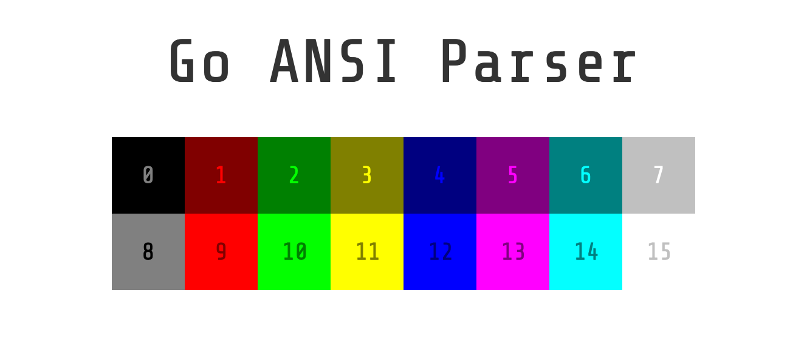

<p align="center" style="text-align: center">
   <br/>
</p>
<p align="center">
   A library for parsing ANSI encoded strings<br/><br/>
   <a href="https://github.com/leaanthony/go-ansi-parser/blob/master/LICENSE"></a>
   <a href="https://goreportcard.com/report/github.com/leaanthony/go-ansi-parser"></a>
   <a href="http://godoc.org/github.com/leaanthony/go-ansi-parser"></a>
   <a href="https://github.com/leaanthony/go-ansi-parser/issues"></a>
   <a href="https://app.fossa.io/projects/git%2Bgithub.com%2Fleaanthony%2Fgo-ansi-parser?ref=badge_shield" alt="FOSSA Status"></a>
</p>

Go ANSI Parser converts strings with [ANSI escape codes](https://en.wikipedia.org/wiki/ANSI_escape_code)
into a slice of structs that represent styled text. Features:

  * Can parse ANSI 16, 256 and TrueColor
  * Supports all styles: Regular, Bold, Faint, Italic, Blinking, Inversed, Invisible, Underlined, Strikethrough
  * Provides RGB, Hex, HSL, ANSI ID and Name for parsed colours
  * Truncation - works with emojis and grapheme clusters 
  * Length - works with emojis and grapheme clusters
  * Cleanse - removes the ansi escape codes
  * Configurable colour map for customisation
  * 100% Test Coverage

# Installation
```shell
go get github.com/leaanthony/go-ansi-parser
```

## Usage

### Parse
```go
text, err := ansi.Parse("\u001b[1;31;40mHello World\033[0m")

// is the equivalent of...

text := []*ansi.StyledText{
    {
        Label: "Hello World",
        FgCol: &ansi.Col{
            Id:   9,
            Hex:  "#ff0000",
            Rgb:  &ansi.Rgb{ R: 255, G: 0, B: 0 },
            Hsl:  &ansi.Hsl{ H: 0, S: 100, L: 50 },
            Name: "Red",
        },
        BgCol: &ansi.Col{
            Id:   0,
            Hex:  "#000000",
            Rgb:  &ansi.Rgb{0, 0, 0},
            Hsl:  &ansi.Hsl{0, 0, 0},
            Name: "Black",
        },
        Style: 1,
    },
}
```
### Truncating
```go
shorter, err := ansi.Truncate("\u001b[1;31;40mHello\033[0m \u001b[0;30mWorld!\033[0m", 8)

// is the equivalent of...

shorter := "\u001b[1;31;40mHello\033[0m \u001b[0;30mWo\033[0m"
```
### Cleanse
```go
cleaner, err := ansi.Cleanse("\u001b[1;31;40mHello\033[0m \u001b[0;30mWorld!\033[0m")

// is the equivalent of...

cleaner := "Hello World!"
```
### Length
```go
length, err := ansi.Length("\u001b[1;31;40mHello\033[0m \u001b[0;30mWorld!\033[0m")

// is the equivalent of...

length := 12

// Works with grapheme clusters and emoji
length, err := ansi.Length("\u001b[1;31;40m👩🏽‍🔧😎\033[0m") // 2
```
